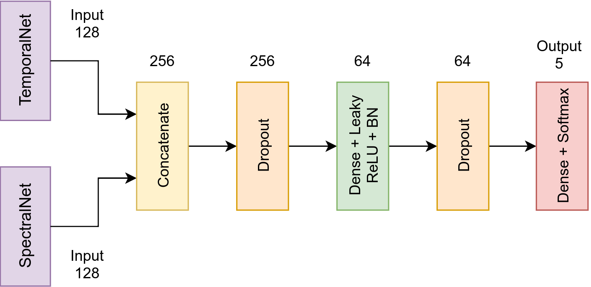
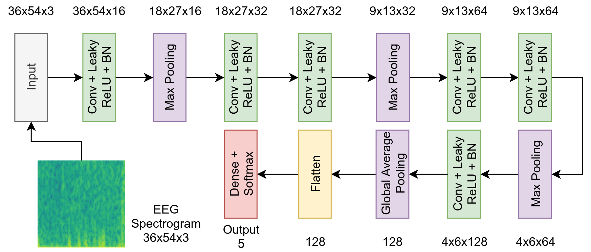
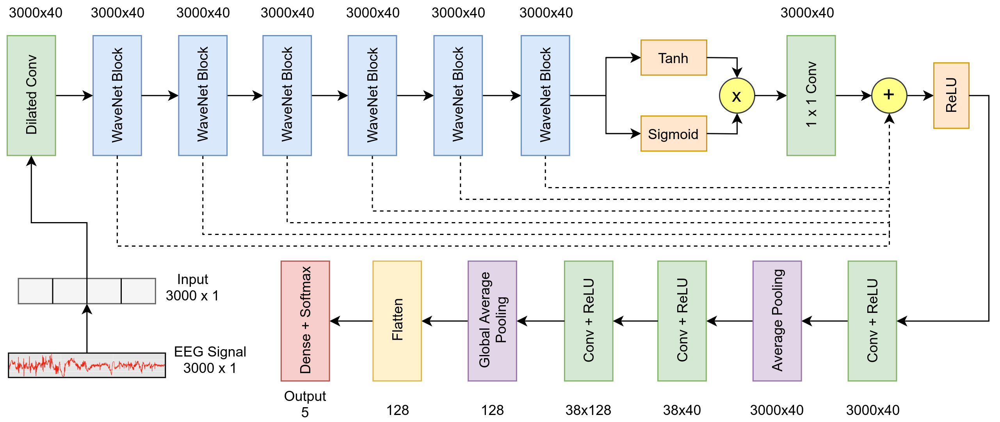
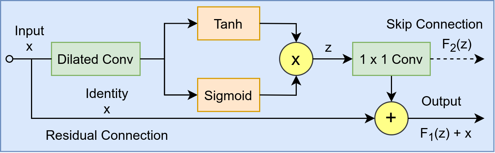

# SpectroTemporalNet: Automated Sleep Stage Scoring with Stacked Generalization

Polysomnography (PSG) has become a pivotal diagnostic tool in sleep medicine. The scoring obtained on the resultant data from sources including Electroencephalograms (EEG) for these studies are interpreted by Sleep Disorder Specialists (SDS) to identify various sleeping disorders. However this process is tedious and requires highly skilled experts. With the recent advent of Deep Learning techniques, neural networks can be utilized to assist in finding such irregularities in sleep data. This paper proposes a Deep Learning based ensemble model called SpectroTemporalNet for automating the process of sleep stage scoring from single-channel raw EEG data. SpectroTemporalNet uses Stacked Generalization to achieve a better annotation performance as compared to that of existing literature with an overall classification accuracy of 94.31\% and a sensitivity of 94\% on the test set. The proposed model utilizes both the spectral and the temporal features of EEG data simultaneously thereby improving automated sleep stage scoring.

## SpectroTemporalNet Architecture

## SpectralNet Architecture

## TemporalNet Architecture

### WaveNet block adapted for TemporalNet
